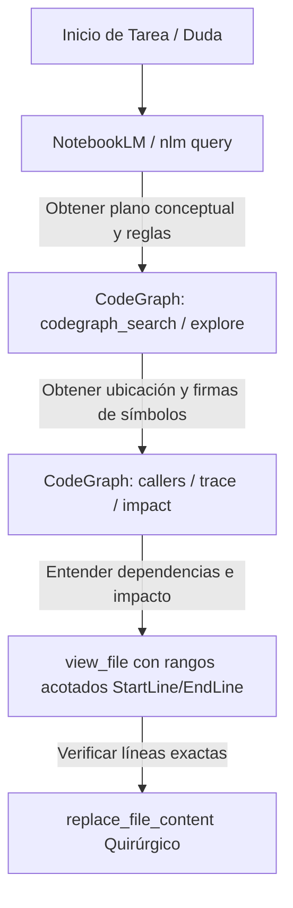

# Flujo de Trabajo: NotebookLM (nlm CLI) y CodeGraph Híbrido

**Nombre sugerido para el Workflow:** `Use NotebookLM and CodeGraph`
**Comando sugerido:** `/lovable-features`

Este workflow establece las pautas obligatorias para resolver dudas técnicas, de negocio o arquitectónicas del proyecto **VerdNatura HRMS** (`vnvacaciones` / `vnapp-refactor`) combinando la potencia conceptual de **NotebookLM** (mediante la CLI oficial `nlm` / MCP `notebooklm-mcp`) y la precisión estructural del AST de **CodeGraph** para minimizar radicalmente el consumo de tokens y maximizar la precisión de las respuestas.

---

## 1. Reglas Generales de Oro

- **NUNCA** leas archivos completos de código (`view_file` sin rangos) o realices búsquedas `grep` masivas "a ciegas" para entender la arquitectura.
- **NUNCA** adivines ni inventes dependencias si existe CodeGraph en el proyecto.
- **SIEMPRE** prioriza las herramientas de menor consumo de tokens primero (NotebookLM & CodeGraph) antes de tocar el sistema de archivos local.

---

## 2. Paso 0: Inyección y Sincronización de Conocimiento (Pre-requisito)

NotebookLM cuenta con un cuaderno dedicado: **`LovableFeatures`** (`a0f74dc3-ae95-4ddd-817b-a565677c6c5a`), gestionado con la nueva arquitectura basada en Python 3.12 y llamadas directas a la API RPC interna de Google (`gemini-notebook-mcp-cli` / `nlm`):

* **Sincronización Atómica de Documentos:**
  ```bash
  python sync_nlm.py
  ```
  *(Sube y actualiza automáticamente los documentos de `docs_md/` hacia el cuaderno).*

* **Desduplicación Instantánea:**
  ```bash
  python dedup_nlm.py
  ```
  *(Audita todas las fuentes y elimina versiones duplicadas reteniendo la más reciente).*

* **Autenticación y Perfil:**
  ```bash
  nlm login
  ```

---

## 3. Paso 1: Búsqueda Conceptual y de Reglas de Negocio con NotebookLM

Ante cualquier requerimiento, duda sobre pantallas generadas por Lovable, reglas de negocio del convenio o guías de refactorización limpia:

1. **Consulta con la CLI Directa `nlm`:**
   ```bash
   nlm notebook query a0f74dc3-ae95-4ddd-817b-a565677c6c5a "¿Cómo está estructurado el SalarySimulator y cómo se conecta con los tramos salariales?"
   ```
2. **Consulta vía Servidor MCP (`notebooklm-mcp`):**
   * Invoca la herramienta `notebook_query` pasando `notebook_id: "a0f74dc3-ae95-4ddd-817b-a565677c6c5a"`.
   * **Tip de Ahorro de Tokens:** Mantén el `conversation_id` activo entre preguntas consecutivas para reutilizar el contexto del lado del servidor de Google de forma sumamente económica.

---

## 4. Paso 2: Análisis Estructural con CodeGraph (AST)

Una vez que NotebookLM te haya dado el plano conceptual (por ejemplo: *"El componente principal es SalarySimulator.tsx y se conecta con el hook useSalaryData"*), utiliza CodeGraph para navegar estructuralmente sin leer archivos a ciegas:

1. **Ubicación Exacta de Símbolos:**
   * Usa `codegraph_search` o `codegraph_explore` para encontrar el símbolo (clase, función, interfaz, componente).
2. **Contexto sin Lectura Completa:**
   * Usa `codegraph_context` o `codegraph_node` para obtener la firma del componente o función sin descargar el archivo.
3. **Análisis de Impacto y Trazabilidad (CRÍTICO):**
   * Usa `codegraph_callers` para ver qué componentes invocan a esta función.
   * Usa `codegraph_impact` para evaluar qué se rompería si modificas este archivo.
   * Para ver un flujo completo de extremo a extremo, utiliza **una sola llamada** a `codegraph_trace`. Esto evita hacer bucles manuales de búsqueda.

---

## 5. Paso 3: Modificación y Lectura Quirúrgica (FileSystem)

Solo cuando hayas completado los Pasos 1 y 2, y sepas exactamente qué líneas necesitas ver o cambiar:

1. **Lectura Quirúrgica:**
   * Usa `view_file` **especificando siempre `StartLine` y `EndLine`** del rango detectado por CodeGraph.
2. **Aplicar los Cambios:**
   * Usa `replace_file_content` para ediciones contiguas simples.
   * Usa `multi_replace_file_content` para ediciones no contiguas.

---

## Resumen del Algoritmo del Agente


